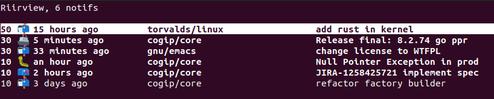

# riirview
TUI to read your github notifications

Inspiration come from the best RSS reader [elfeed](https://github.com/skeeto/elfeed) and
[elfeed-score](https://github.com/sp1ff/elfeed-score).

Today most of us are struggling with a lot of repos and it's very hard to keep track of all the
notifications. Github provide a nice webview https://github.com/notifications, but it's not well
suited for 100+ notifications.

Riirview provide a custom scoring system so all your important notifications appear on
top of the list.

Moving down, all notifications below a certain point are probably good to trash.

## screenshot



## Rules

Rules are defined in `rules.toml`

On linux, create the file as `~/.config/riirview/rules.toml`

Here is an example

```toml
[me]
rule="author"
param="JohnDoe"
score=100

[my_fav_repos]
rule="repo"
param="torvalds/linux, emacs-mirror/emacs"
score=5

[emacs]
rule="title"
param="emacs"
score=5

```

Rules are named by an arbitrary name defined per section, eg `my_fav_repos`

`rule` define the rule that will be used, see section below.

`param` is a string (with comma as separator) that will be passed to the rule

`score` the score increment if the notification matches the rule.

Here are the rules available:

### author

`rule="author"` match if one of the comma-separated `param` is author of the PR

Note: this rule works only for Pull Request notification.

### repo

`rule="repo"` match if one of the comma-separated `param` is the repo this notification is for.

### title

`rule="title"` match if one of the comma-separated `param` is in the notification title.

### org
`rule="org"` each comma-separated `param` can be optionally prefixed by a `!`

For each param,
  If no `!` is present the rule matches if the notification organization matches the param.

  If `!`is present the rule matches if the notification organization doesn't match the param.

Eg: if you are flooded by corporate notifications related to the `cogip` orga, `params="!cogip"` will
boost all non-work related notifications. Or you can pay attention to all PR from the whole rust
foundation with `params="rust-lang"`

### reason

`rule="reason"` match if one of the comma-separated `param` is in the notification reason.

See
https://docs.github.com/en/rest/activity/notifications?apiVersion=2022-11-28#about-notification-reasons

Eg:
`param="approval_requested, assign, author, comment, manual, mention, review_requested"`

We don't do any validity check on param.

## Keymap

| key               | action                                     |
|-------------------|--------------------------------------------|
| up/down           | move cursor up or down                     |
| page up/page down | move cursor by 10 elements                 |
| +                 | manually increase score                    |
| -                 | manually decrease score                    |
| g                 | refresh notifications                      |
| enter             | open github page                           |
| r                 | mark notification as done                  |
| R                 | mark all notifications below cusor as done |
| x                 | explain scoring                            |
| ?                 | show help popup                            |
| q                 | quit                                       |

Note on "explain scoring": display rules matching this notification. Rules are recomputed on demand,
if you have changed your rule file, the result might not match the score in db.


## Files

Riirview respect XDG directory specification.

Here is where we store data (on linux)

 * Rule file: `~/.config/riirview/rules.toml`
 * Logs: `~/.cache/riirview/riirview.log`
 * Sqlite db `~/.local/share/riirview/riirview.db`

For other OS, see [here](https://github.com/dirs-dev/directories-rs?tab=readme-ov-file#projectdirs)

## Environment variables

 * `RUST_LOG`: manage log level: `debug`, `info` (default), `error`

## FAQ

### Why this name?

`riir` is `rewrite it in rust`.
`riirview` sound like `review` and a `rear view` mirror is a useful device.
